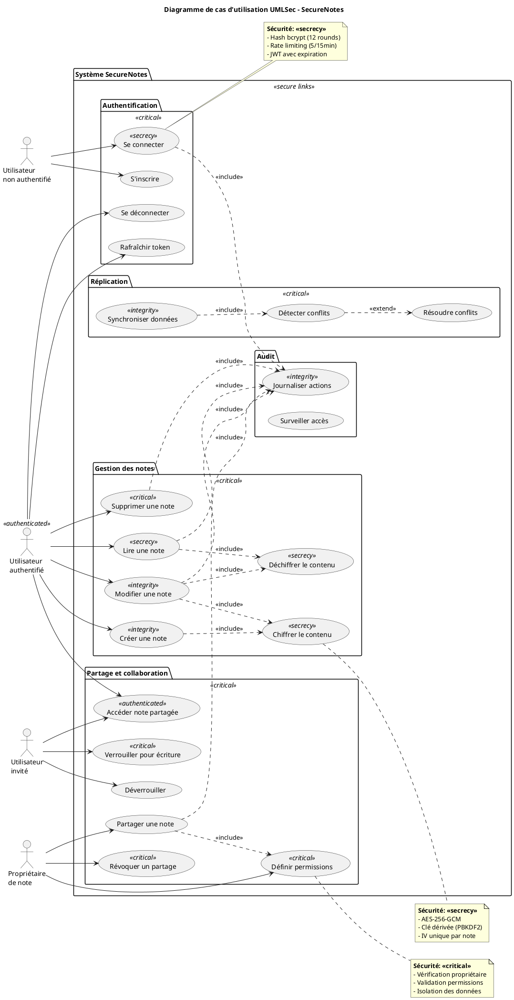
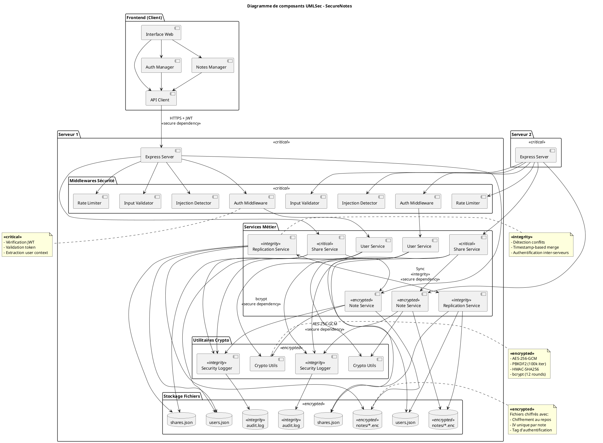
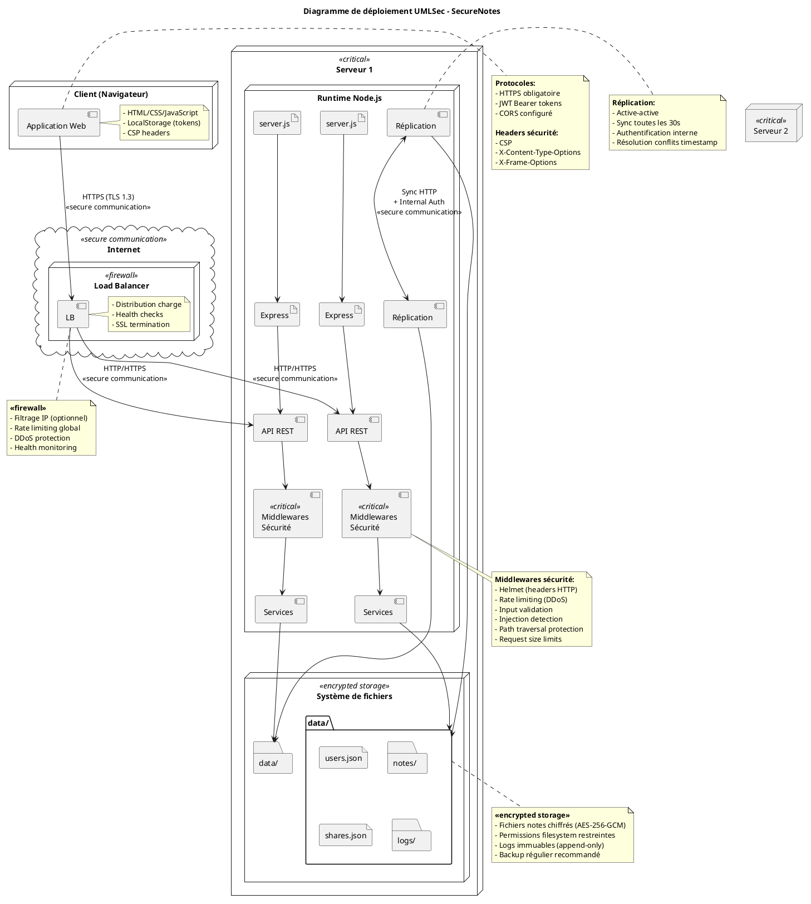
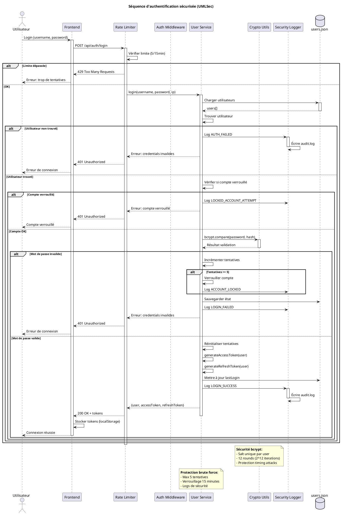
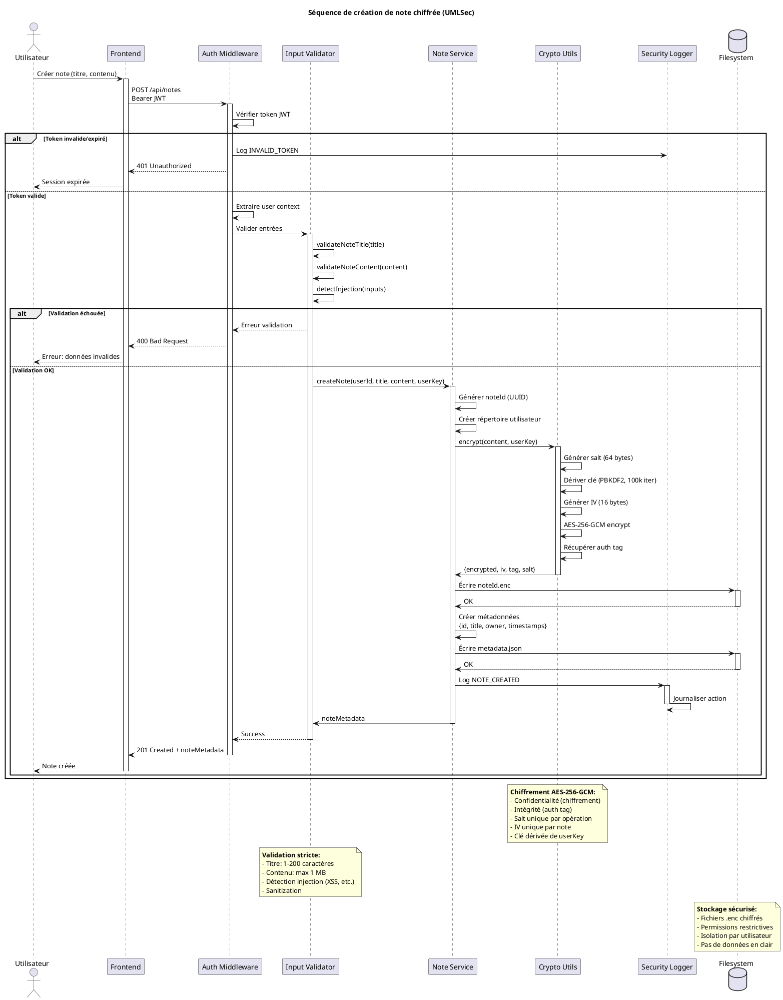

# Diagrammes UMLSec - SecureNotes

## 1. Diagramme de cas d'utilisation UMLSec

---

## 2. Diagramme de composants UMLSec

---

## 3. Diagramme de déploiement UMLSec

---

## 4. Diagramme de séquence - Authentification sécurisée

---

## 5. Diagramme de séquence - Création de note chiffrée

---

## Annotations de sécurité utilisées

### Stéréotypes UMLSec appliqués :

1. <<**secrecy**>> : Garantit la confidentialité
   - Connexion (credentials)
   - Chiffrement/déchiffrement des notes
   - Stockage des mots de passe

2. <<**integrity**>> : Garantit l'intégrité
   - Création/modification de notes
   - Logs d'audit
   - Réplication des données

3. <<**critical**>> : Ressources critiques nécessitant protection maximale
   - Système d'authentification
   - Gestion des permissions
   - Verrouillage de notes
   - Serveurs et composants sensibles

4. <<**secure links**>> : Communications sécurisées
   - HTTPS entre client et serveur
   - Authentification inter-serveurs

5. <<**secure dependency**>> : Dépendances sécurisées entre composants
   - Utilisation de JWT
   - Appels aux utilitaires crypto
   - Réplication authentifiée

6. <<**encrypted**>> : Données chiffrées
   - Stockage des notes
   - Service de chiffrement
   - Fichiers .enc

7. <<**authenticated**>> : Accès nécessitant authentification
   - Utilisateur connecté
   - Routes protégées

8. <<**firewall**>> : Protection périmétrique
   - Load balancer
   - Filtrage réseau

9. <<**encrypted storage**>> : Stockage chiffré
   - Système de fichiers
   - Notes sur disque

## Propriétés de sécurité garanties

- **Confidentialité** : AES-256-GCM, HTTPS, JWT
- **Intégrité** : HMAC, auth tags, logs immuables
- **Authentification** : bcrypt, JWT, rate limiting
- **Autorisation** : RBAC, vérification permissions
- **Non-répudiation** : Logs d'audit horodatés
- **Disponibilité** : Réplication active-active
